# The Basics of Visual Testing with Selenium

# 01. What is Visual Testing?
## What is Visual Testing?
Visual testing is a software testing practice that focuses on validating the appearance of a user interface (UI). Unlike traditional functional testing, which verifies the behavior of software, visual testing ensures that the UI looks and functions correctly across different devices, screen sizes, and browsers. It checks for visual anomalies such as layout issues, misaligned elements, color inconsistencies, and other UI defects that could negatively impact the user experience.

## Why is Visual Testing Needed?
Visual testing is needed because it helps to ensure a consistent and visually appealing user experience across all platforms. As applications become more complex and need to run on a variety of devices, visual testing catches issues that functional tests might miss. These issues can include:
- **Cross-Browser and Cross-Device Compatibility:** Ensuring that your application looks and functions correctly on different browsers and devices.
- **Regression Testing:** Detecting unintended visual changes after code updates.
- **User Experience (UX):** Maintaining a polished and professional appearance that aligns with brand guidelines.
- **Reduced Maintenance:** By catching visual bugs early, visual testing can reduce the time and cost associated with fixing UI-related defects.

Overall, visual testing complements functional testing by covering aspects of the UI that traditional tests don't, ultimately leading to a more reliable and user-friendly application.

## How does Visual Testing compare to traditional Functional Testing?

| Traditional Functional Testing  | Visual Testing          |
|---------------------------------|-------------------------|
| ✔ Functional Coverage           | ✔ Functional Coverage   |
| ❌ Visual Coverage               | ✔ Visual Coverage       |
| ❌ High Maintenance              | ✔ Minimal Maintenance   |

# 02. What is Applitools?
## Common Methods to Catch Visual Defects
1. DOM Comparison

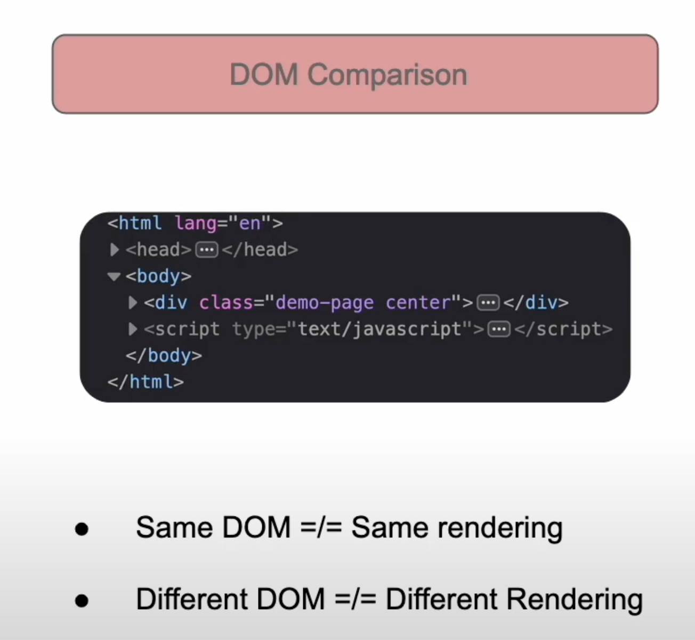

2. Pixel-to-Pixel Comparison

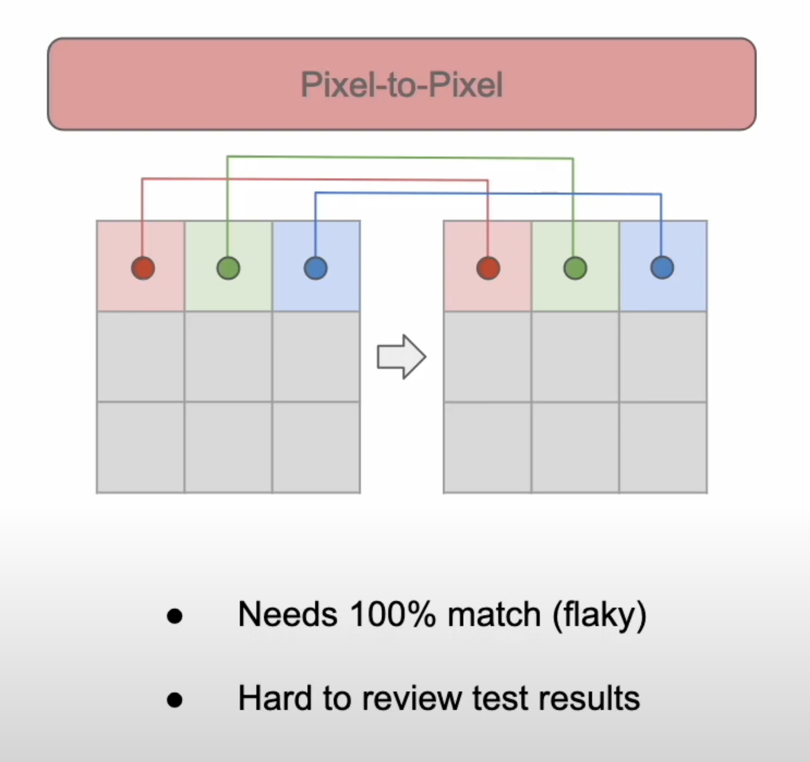


## What is Applitools Eyes?
Applitools captures visual bugs with a different approach. Rather than basic pixel-to-pixel comparisons or DOM comparisons, Applitools uses a highly trained AI that mimics the human eyes. The Applitools Eyes AI is smart enough to understand if a difference is significant enough to report or if it can be safely ignored. It will sift through all the “noise” and give you clear and concise results.


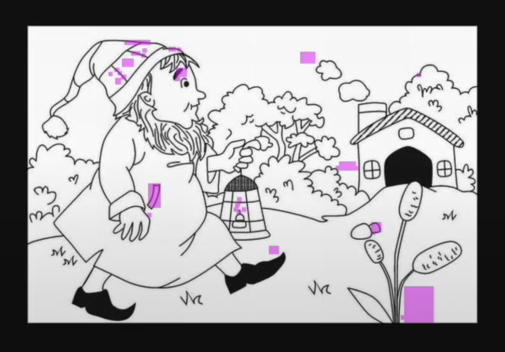

## How does applitools standsout compared to other visual testing tools? 
* Mimics the human eyes and ignores insignificant changes
* Provides Clear test results allowing users to clearly understand what's changed in the application
* Validates that elements render correctly in the browser.

| DOM Comparison                | Eyes Visual AI            | Pixel-To-Pixel          |
|--------------------------------|---------------------------|-------------------------|
| ❌ False Negatives              | ✔ Highly accurate         | ❌ Flaky                 |
| ❌ False Positives              | ✔ Clear results           | ❌ Unclear Results       |
| ❌ Doesn’t account for rendering in browser | ✔ Mimics human eyes |                         |

# 03. How does Applitools fit into our testing environment?
- [Applitools SDKs](https://applitools.com/docs/api-ref/)
- [CI/CD Integrations](https://applitools.com/docs/topics/integrations.html)
- [Ultrafast Grid](https://applitools.com/docs/topics/overview/using-the-ultrafast-grid.html)
- [Applitools Dashboard](https://eyes.applitools.com/app/test-results/)

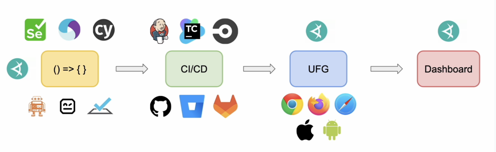

# 04. Writing our first test
## Setup an Applitools account and access our API key
1. Open [Applitools Signup](https://auth.applitools.com/users/register) page to create an account.
2. Access your API key from your dashboard.
## Clone the sample repository
1. Clone the sample repository from [Github](https://github.com/applitools/JavaSeleniumDemo)
## Add the Applitools SDK
1. Add [Applitools Eyes](https://mvnrepository.com/artifact/com.applitools/eyes-selenium-java5/5.22.0) from Maven repository.
## Anotomy of an Applitools Visual Test
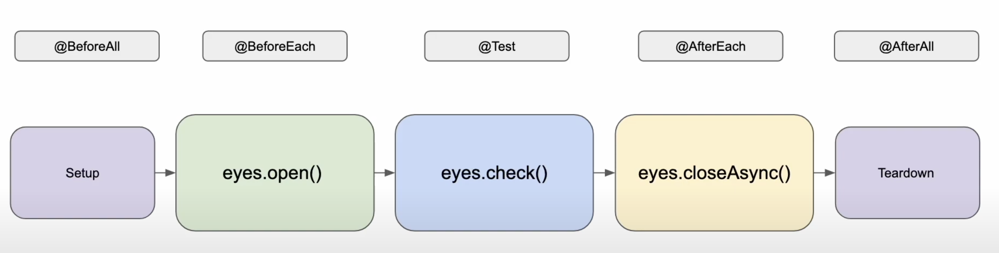
## Run our first visual test
Run the tests.

# 05. Reviewing Test Results
## What is a baseline?
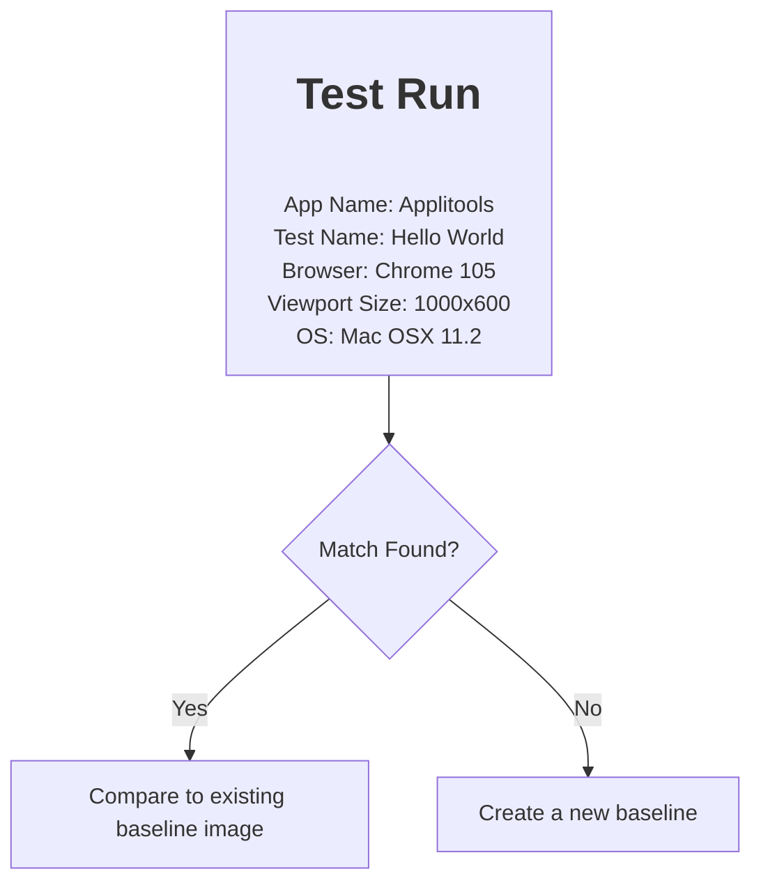
- For the very first time of execution of the test, a baseline is created. When the test is run again, the baseline is used to compare the results.

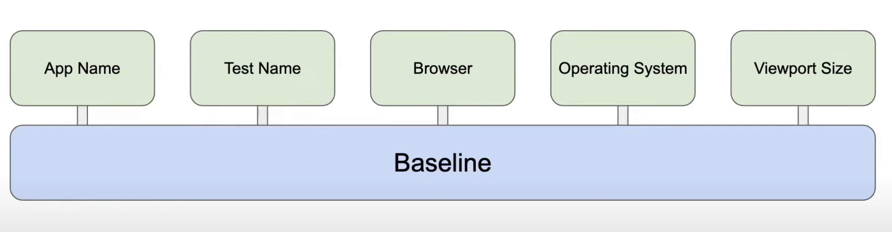
- Baseline made of up of variables like app name, test name, browser, operating system, viewport size, and so on.

## Applitools Dashboard Overview
1. We could see 'New' status for the very first time of execution of the test for the baseline.
2. We could see 'Passed' status when the test is run again.
3. We could see 'Unresolved' status when the test fails.

## Analyzing our test results
1. When the baseline is mismatched, we get a 'Unresolved' status.
2. While clicking 'Hightlight' button, we could see the 'Mismatched' pixels.
3. We could either ```Thumbs Up```(👍) means Accept or ```Thumbs Down```(👎) means Reject.
4. Click on Save icon to save further otherwise unsaved.
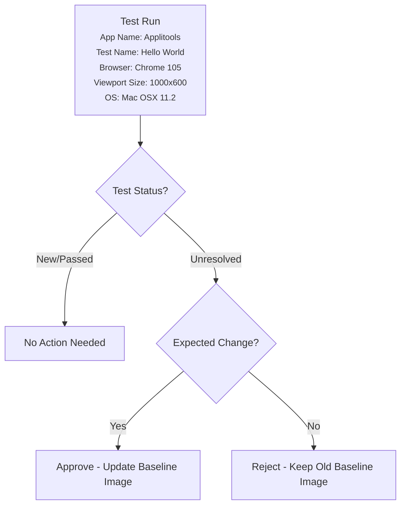
> When an Unresolved test has been approved, the baseline image is overwritten by the checkpoint image that was just approved

# 6. Best Practices
## 6.1 Batching
### What is a batch?
- Class provided in Eyes SDKs
- Group tests together
- Contains a name and ID
```java
// TestCase.java 
public class TestCase {

    static WebDriver driver;
    static BatchInfo myBatch;
    Eyes eyes;

    @BeforeAll
    public static void beforeAll() {
        // Batch reference is created using BatchInfo class
        myBatch = new BatchInfo("My First Batch");
        driver = WebDriverManager.chromedriver().create();
    }

    @BeforeEach
    public void beforeEach(TestInfo testInfo) {
        eyes = new Eyes();
        eyes.setBatch(myBatch); // Batch reference is passed to the eyes object
        eyes.setApiKey(System.getenv("APPLITOOLS_API_KEY"));
        eyes.open(
            driver,
            "My First Tests",
            testInfo.getTestMethod().get().getName(),
            new Dimension(1000, 600)
        );
    }

    @Test
    public void test1() {...}

    @Test
    public void test2() {...}

    @Test
    public void test3() {...}

    @AfterEach
    public void afterEach() {
        eyes.closeAsync();
    }

    @AfterAll
    public static void afterAll() {
        driver.quit();
    }
}

```
## 6.2 Configuration
- Configuration should be created once and will be used across all tests.
- Improves the maintainability of your code by allowing you to setup your configurations once rather than in multiple places throughout your code.
```java
// TestCase.java 
public class TestCase {

    static WebDriver driver;
    static BatchInfo myBatch;
    static Configuration suiteConfig;
    Eyes eyes;
    @BeforeAll
    public static void beforeAll() {
        myBatch = new BatchInfo("My First Batch");
        driver = WebDriverManager.chromedriver().create();
        
        // Use below configuration created once for all tests
        suiteConfig = new Configuration(); // 
        suiteConfig.setApiKey(System.getenv("APPLITOOLS_API_KEY"));
        suiteConfig.setBatch(myBatch);
    }

    @BeforeEach
    public void beforeEach(TestInfo testInfo) {
        eyes = new Eyes();
        eyes.setConfiguration(suiteConfig); // Configuration is set
        eyes.open(
            driver,
            "My First Tests",
            testInfo.getTestMethod().get().getName(),
            new Dimension(1000, 600)
        );
    }
}
```

## 6.3 Runners
### What is a Runner?
- Classic vs. Ultrafast Grid
- Access to test results for the whole test run
- Runner object allows you to tap into test results for every test that uses that runner object
```java
// TestCase.java 
public class TestCase {

   static EyesRunner testRunner;
    @BeforeAll
    public static void beforeAll() {
       testRunner = new ClassicRunner();
    }

    @BeforeEach
    public void beforeEach(TestInfo testInfo) {
        eyes = new Eyes(testRunner);
    }

    @AfterAll
    public static void afterAll() {
        TestResultsSummary allTestResults = testRunner.getAllTestResults();
    }
}
```

# 7. Ultrafast Grid
- DOM Snapshot
- Faster test execution
- Run once, render across all targetted devices/ environment
- Easily add more coverage by updating the Eyes SDKs configuration

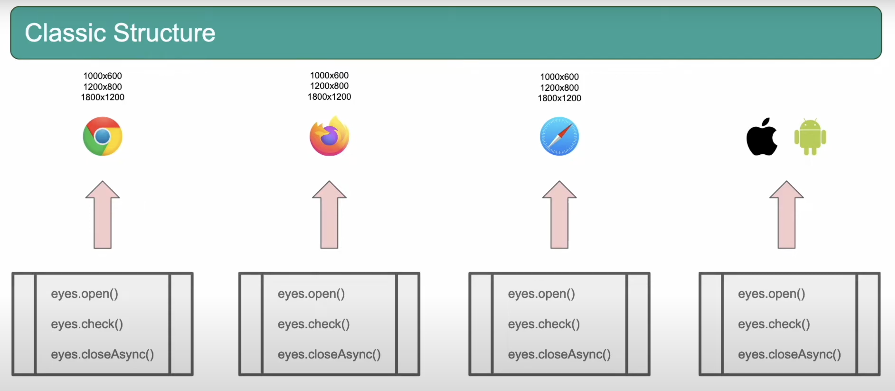

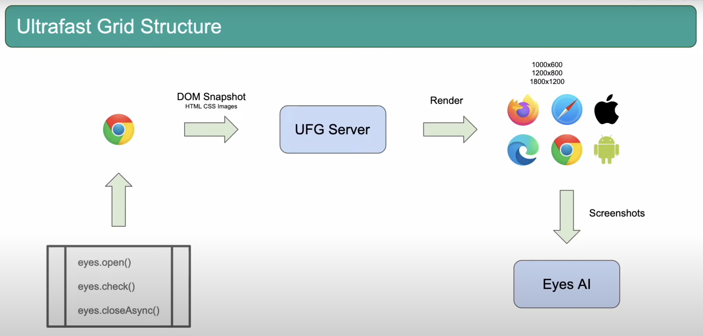

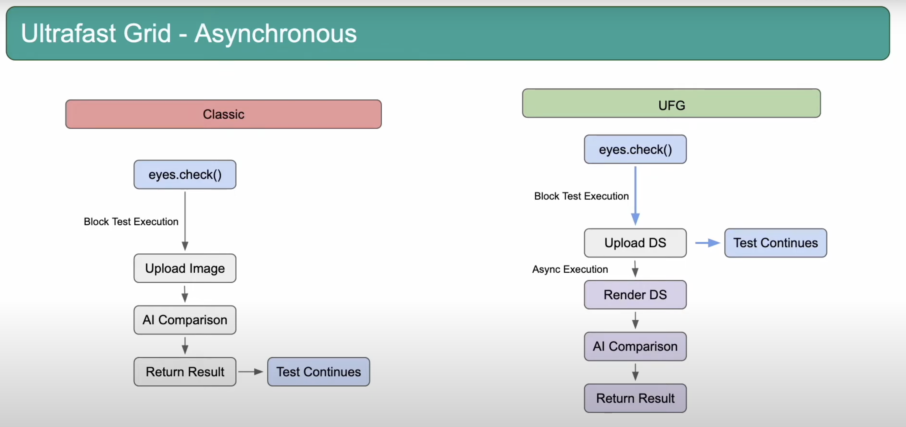

```java
@BeforeAll
public static void beforeAll() {
    myBatch = new BatchInfo("My First Batch");
    driver = WebDriverManager.chromedriver().create();
    suiteConfig = new Configuration();
    suiteConfig.setApiKey(System.getenv("APPLITOOLS_API_KEY"));
    suiteConfig.setBatch(myBatch);

    // Add desktop browsers
    suiteConfig.addBrowser(800, 600, BrowserType.CHROME);
    suiteConfig.addBrowser(1600, 1200, BrowserType.FIREFOX);
    suiteConfig.addBrowser(1024, 768, BrowserType.SAFARI);

    // Add mobile devices
    suiteConfig.addDeviceEmulation(DeviceName.Pixel_2, ScreenOrientation.PORTRAIT);
    suiteConfig.addDeviceEmulation(DeviceName.Nexus_10, ScreenOrientation.PORTRAIT);

    testRunner = new VisualGridRunner(new RunnerOptions().testConcurrency(5));
}
```

# Resources
- [Ultrafast Grid](https://applitools.com/docs/topics/overview/using-the-ultrafast-grid.html)


